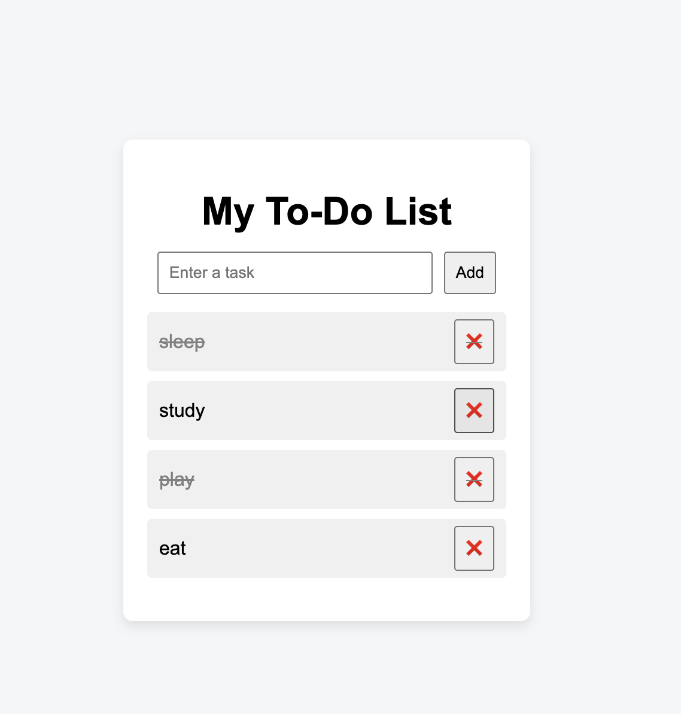

# 📝 To-Do App

A simple and clean To-Do application built using **HTML, CSS, and JavaScript**.

This project was created as a beginner-friendly project to practice core web development concepts.

---

## 🚀 Features
- ➕ Add tasks (button & Enter key)
- ❌ Delete tasks
- ✅ Mark tasks as completed
- 💾 Save tasks using LocalStorage
- 🎨 Clean and simple UI

---

## 🛠️ Technologies Used
- HTML
- CSS
- JavaScript (Vanilla JS)

---

## 📸 Screenshot

---

## 📚 What I Learned
- DOM manipulation using JavaScript
- Handling click and keyboard events
- Using LocalStorage for data persistence
- Basic Git and GitHub workflow

---

## 🔗 Live Demo
_Will be added after deployment_